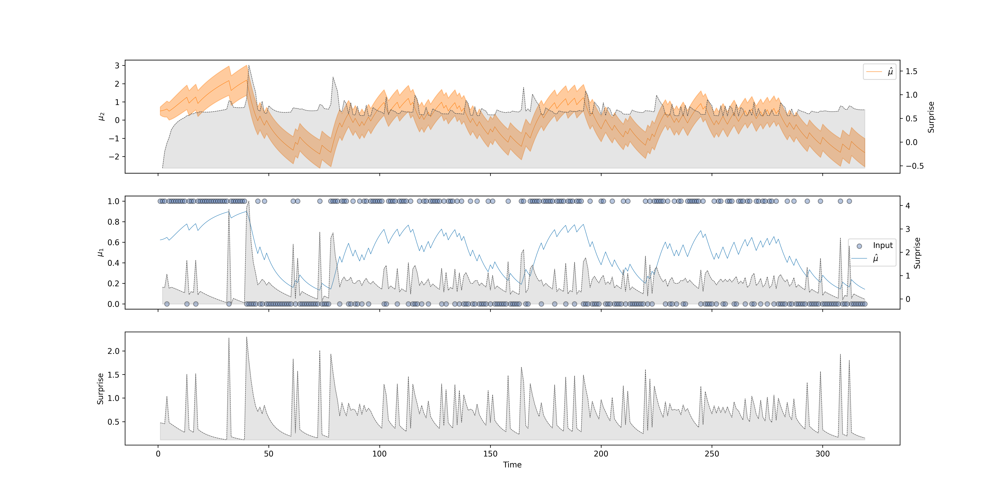

[](https://github.com/pre-commit/pre-commit) [](https://github.com/ilabcode/pyhgf/blob/master/LICENSE) [](https://codecov.io/gh/ilabcode/pyhgf) [](https://github.com/psf/black) [](http://mypy-lang.org/) [](https://pycqa.github.io/isort/)

# The multilevel, generalized and nodalized Hierarchical Gaussian Filter for predictive coding

pyhgf is a Python library for generalized and nodalized Hierarchical Gaussian Filters for predictive coding {cite:p}`2011:mathys,2014:mathys` written on top of [JAX](https://jax.readthedocs.io/en/latest/jax.html). The library consists in a set of function to create graphs of interconnected nodes and recursively update them from precision-weighted prediction errors under new observations. The codebase interface natively with other libraries in the JAX ecosystem or  probabilistic programming tools for Bayesian inference.

* 🎓 [What is a Hierarchical Gaussian Filter?](https://ilabcode.github.io/pyhgf/theory.html)  
* 📖 [API Documentation](https://ilabcode.github.io/pyhgf/)  
* ✏️ [Tutorials and examples](https://ilabcode.github.io/pyhgf/tutorials.html)  

## Getting started

### Installation

The last official release can be download from PIP:

`pip install pyhgf`

The current version under development can be installed from the master branch of the GitHub folder:

`pip install “git+https://github.com/ilabcode/pyhgf.git”`

### How does it works?

A Hierarchical Gaussian Filter consists in a network of probabilistic nodes hierarchically structured where each node can inherit its value and volatility sufficient statistics from other parents node. The presentation of a new observation at the lower level of the hierarchy (i.e. the input node) trigger a recursuve update of the nodes belief throught the bottom-up propagation of precision-weigthed prediction error.

A node is formally defined as a Python tuple containing 3 variables:

* A `parameter` dictionary containing the node parameters (value, precision and parameters controlling the dependencies from values and variability parents).
* A tuple of value parent(s) (optional).
* A tuple of volatility parent(s) (optional).

Value parent and volatility parent are nodes themself and are built from the same principles. A filtering structure consists in nodes embedding other nodes hierarchically. In Python, this is implemented as tuples containing other tuples. Nodes can be parametrized by their sufficient statistic and update rules. One node can have multiple value/volatility parents, and influence multiple children nodes separately. The transformations between nodes can be linear or non-linear (thus a *generalization* of the HGF).

### The Hierarchical Gaussian Filter

The Hierarchical Gaussian Filter for binary and continuous inputs as it was described in {cite:p}`2014:mathys,2011:mathys`, and later implemented in the Matlab Tapas toolbox {cite:p}`frassle:2021`, can be seen as a special case of this node structure such as:


The pyhgf package includes pre-implemented standard HGF models that can be used together with other neural network libraries of Bayesian inference tools. It is also possible for the user to build custom network structures that would match specific needs.

### Model fitting

Here we demonstrate how to fit a two-level binary Hierarchical Gaussian filter. The input time series are binary outcome from {cite:p}`iglesias:2013`.

```python
from pyhgf.model import HGF
from pyhgf import load_data

# Load time series example data
timeserie = load_data("binary")

# This is where we define all the model parameters - You can control the value of
# different variables at different levels using the corresponding dictionary.
hgf = HGF(
    n_levels=2,
    model_type="binary",
    initial_mu={"1": .0, "2": .5},
    initial_pi={"1": .0, "2": 1e4},
    omega={"1": None, "2": -3.0},
    rho={"1": None, "2": 0.0},
    kappas={"1": None},
    eta0=0.0,
    eta1=1.0,
)

# add new observations
hgf.input_data(input_data=timeserie)

# compute the model's surprise (-log(p))
surprise = hgf.surprise()
print(f"Model's surprise = {surprise}")

# visualization of the belief trajectories
hgf.plot_trajectories()
```

`Creating a binary Hierarchical Gaussian Filter with 2 levels.`  
`Add 320 new binary observations.`  
`Model's surprise = 203.29249572753906`



# Acknoledgements

This implementation of the Hierarchical Gaussian Filter was largely inspired by the original [Matlab version](https://translationalneuromodeling.github.io/tapas). A Julia implementation of the generalised, nodalised and multilevel HGF is also available [here](https://github.com/ilabcode/HGF.jl).

```{toctree}
---
hidden:
---
Theory <theory.md>
Tutorials <tutorials.md>
API <api.rst>
Cite <cite.md>
References <references.md>
```
