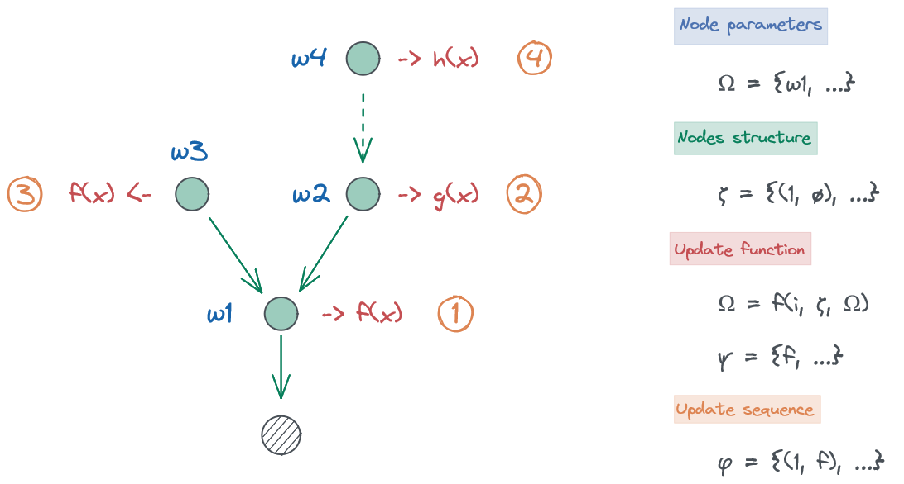

---
jupytext:
  formats: ipynb,md:myst
  text_representation:
    extension: .md
    format_name: myst
    format_version: 0.13
    jupytext_version: 1.14.5
kernelspec:
  display_name: Python 3 (ipykernel)
  language: python
  name: python3
---

(probabilistic_networks)=
# Creating and manipulating dynamic probabilistic networks

+++

## Implementation details

Under the hodd, [pyhgf] is a graph neural network library that include specialized variational message passing update methods. The agents and behaviors are built on the top of the probabilistic network structure, and it is inside this structure that most of the computation and updating is happening.


In pyhgf, a probabilistic network is represented by two variables:
1. a `parameter structure` that store the node's parameters. This is implemented as a tuple of dictionaries.
2. a `node structure` that represents the [adjacency list](https://en.wikipedia.org/wiki/Adjacency_list) that store each node's value and volatility parents. This is implemented as a tuple of {ref}`pyhgf.typing.Indexes.`.



```{code-cell} ipython3
from pyhgf.typing import Indexes
parameters = {"mu": 0.0, "pi": 1.0}

parameters_structure = (parameters, parameters, parameters)
node_structure = (
    Indexes((1,), None),
    Indexes(None, (2,)),
    Indexes(None, None),
)
```

The code above illustrate the creation of a probabilistic network of 3 nodes with simple parameters sets $(\mu=0.0, \pi=1.0)$. Node 2 is the value parent of node 1. Node 3 is the value parent of node 2 and has no parents.

+++

## Visualizing the node structure

```{code-cell} ipython3
from pyhgf.model import HGF

# create a three-level HGF using default parameters
hgf = HGF(n_levels=3, model_type="continuous")
hgf.plot_network()
```

## Building a custom node structure
The two and three-level continuous and binary HGF are special cases of probabilistic networks that can be manipulated by pyhgf. We can indeed build probabilistic networks with arbitrary structure. Notably,
- one node can have multiple parents and/or children, both in the value and volatility domains.
- the network can have multiple input node, binary and/or continuous.

For example, the following network is a valid HGF structure:

```{code-cell} ipython3
custom_hgf = (
    HGF(n_levels=3, model_type=None)
    .add_input_node(kind="continuous")
    .add_value_parent(children_idxs=[0])
    .add_value_parent(children_idxs=[1])
    .add_value_parent(children_idxs=[1])
    .add_value_parent(children_idxs=[1])
    .add_volatility_parent(children_idxs=[2, 3])
    .add_volatility_parent(children_idxs=[4])
    .add_value_parent(children_idxs=[5, 6])
)
custom_hgf.plot_network()
```

It is also possible to work with multiple input:

```{code-cell} ipython3
custom_hgf = (
    HGF(model_type=None)
    .add_input_node(kind="continuous", input_idx=0)
    .add_input_node(kind="continuous", input_idx=1)
    .add_input_node(kind="continuous", input_idx=2)
    .add_value_parent(children_idxs=[0])
    .add_value_parent(children_idxs=[1])
    .add_value_parent(children_idxs=[2])
    .add_volatility_parent(children_idxs=[0, 1, 2])
)
custom_hgf.plot_network()
```

The parameters structure and node structures are embedded in the HGF class anc can be retrieved with:

```{code-cell} ipython3
# paramter values from the first node
custom_hgf.parameters_structure[0]
```

```{code-cell} ipython3
# the node structure
custom_hgf.node_structure
```

## Building custom update functions and sequences

Models that are created with parameter structures and node structures only represent static configuration of the HGF, they are not yet filtering new observation or acting in response to specific input. To add a dynamic and responsive layer, we need two additional components:

- update functions
- update sequences

Update functions are the heart of the HGF filtering procedure, these functions implement the message passing and parameters updating steps between node. An update function in its simplier form is a fuction defined as

```python
parameters_structure = update_fn(node_idx=i, parameters_structure, node_structure)
```

In other words, it is updating the parameters structure by applying certain transformation starting at node $i$. The function has acess top the entire parameters and nodes structure, which mean that it can retrive parameters from parents, children, grand-parents etc... Usually, pessage passing updates only use information found in the [Markov blanket](https://en.wikipedia.org/wiki/Markov_blanket) of the given node.

```{code-cell} ipython3

```

## Dynamic manipulation of parameters, structures, sequences and function across time

We have discussed in the previous sections how [pyhgf](https://ilabcode.github.io/pyhgf/index.html) implements probabilistic networks that can learn, filter and act while new observations are coming in. These model require the following variables and methods upon initialization:

- the parameters structure
- the node structure
- the update function
- the update sequences

So far, we assumed that these parameters are static and that the agent had no control over them. However, it is also possible to create models that have dynamics parameter set (i.e. where the node structure, update functions and parameters spaces can change across time) using either a deterministic, or a responsive design.

### Updating node structure 

```{code-cell} ipython3

```
