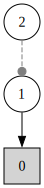

---
jupytext:
  formats: ipynb,md:myst
  text_representation:
    extension: .md
    format_name: myst
    format_version: 0.13
    jupytext_version: 1.14.1
kernelspec:
  display_name: Python 3 (ipykernel)
  language: python
  name: python3
---

(binary_hgf)=
# The binary Hierarchical Gaussian Filter

```{code-cell} ipython3
import jax.numpy as jnp
from ghgf.model import HGF
from ghgf import load_data
import seaborn as sns
import matplotlib.pyplot as plt

sns.set_context("talk")
```

In this notebook, we demonstrate how to use the standard 2-levels and 3-level Hierarchical Gaussian Filters (HGF) for binary inputs. This class of models is very similar to the continuous counterpart that will be discussed in the next example, with the difference that the input node accepts binary data. Such binary responses are widely used in decision-making tasks, and standard reinforcement learning algorithms like Rescorla-Wagenr can learn the probability of outcomes from the history of decisions. By using a Hierarchical Gaussian Filter, however, we can infer from the data the evolution of higher-level volatility, and the parameters that are influencing the strength of the coupling between lower-level nodes with their parents (i.e. $\omega$, or the `evolution rate`). The binary version of the Hierarchical Gaussian Filter can take the following structures:

:::{figure-md} fig-binary
:class: myclass



The 2-levels and 3-level Hierarchical Gaussian Filter for binary inputs. Note that the first level $X_{1}$ is a value parent for the binary input node $\mathcal{B}$, and has itself a value parent $X_{2}$. A volatility parent is only used in the context of a 3-level HGF. This is a specificity of the binary model.
:::


Here, we will use data from a decision-making task where the outcome probability was manipulated across time, and observe how the binary HGFs can track switches in response probabilities.

+++

## Imports
We import a time series of binary responses from the decision task described in {cite:p}`2013:iglesias`.

```{code-cell} ipython3
timeserie = load_data("binary")
```

## Fitting the binary HGF with fixed parameters
### The 2-levels binary Hierarchical Gaussian Filter
#### Create the model

The node structure corresponding to the 2-levels and 3-levels Hierarchical Gaussian Filters are automatically generated from `model_type` and `n_levels` using the nodes parameters provided in the dictionaries. Here we are not performing any optimization so thoses parameters are fixed to reasonnable values.

```{code-cell} ipython3
two_levels_hgf = HGF(
    n_levels=2,
    model_type="binary",
    initial_mu={"1": .0, "2": .5},
    initial_pi={"1": .0, "2": 1e4},
    omega={"1": None, "2": -6.0},
    rho={"1": None, "2": 0.0},
    kappas={"1": None},
    eta0=0.0,
    eta1=1.0,
    pihat = jnp.inf,
)
```

This function create an instance of a HGF model automatically parametrized for a 2-levels binary structure, so we do not have to worry about creating the nodes structure ourself. This class also embed function to add new observations and plots results that we are going to use below.

+++

#### Add data

```{code-cell} ipython3
# Provide new observations
two_levels_hgf = two_levels_hgf.input_data(input_data=timeserie)
```

#### Plot trajectories

+++

A Hierarchical Gaussian Filter is acting as a Bayesian filter when presented new observation, and by running the update equation forward, we can observe the trajectories of the nodes parameters that are being updated after each new observation (i.e. the mean $\mu$ and the precision $\pi$). The `plot_trajectories` function automatically extract the relevant parameters given the model structure and will plot their evolution together with the input data.

```{code-cell} ipython3
-jnp.log(1-.9)
```

```{code-cell} ipython3
two_levels_hgf.plot_trajectories()
```

We can see that the surprise will increase when the time series exhibit more unexpected behaviors. The degree to which a given observation is expected will deppends on the expeted value and volatility in the input node, that are influenced by the values of higher order nodes. One way to assess model fit is to look at the total gaussian surprise for each observation. This values can be returned using the `surprise` method:

```{code-cell} ipython3
two_levels_hgf.surprise()
```

```{note}
The surprise of a model under the observation of new data directly depends on the response function that was used. New response functions can be added and provided using different `response_function_parameters` and `response_function` in the py:func:`ghgf.model.HGF.surprise` method. The surprise is then defined as the negative log probability of new observations:

$$surprise = -log(p)$$
```

+++

### The 3-levels binary Hierarchical Gaussian Filter
#### Create the model
Here, we create a new :py:`ghgf.model.HGF` instance, setting the number of levels to `3`. Note that we are extending the size of the dictionaries accordingly.

```{code-cell} ipython3
three_levels_hgf = HGF(
    n_levels=3,
    model_type="binary",
    initial_mu={"1": .0, "2": .5, "3": 0.},
    initial_pi={"1": .0, "2": 1e4, "3": 1e1},
    omega={"1": None, "2": -6.0, "3": -2.0},
    rho={"1": None, "2": 0.0, "3": 0.0},
    kappas={"1": None, "2": 1.0},
    eta0=0.0,
    eta1=1.0,
    pihat = jnp.inf,
)
```

#### Add data

```{code-cell} ipython3
three_levels_hgf = three_levels_hgf.input_data(input_data=timeserie)
```

#### Plot trajectories

```{code-cell} ipython3
three_levels_hgf.plot_trajectories()
```

## Learning parameters with MCMC sampling
In the previous section, we assumed we knew the parameters of the HGF models that were used to filter the input data. This can give us information on how an agent using these values would behave when presented with these inputs. We can also adopt a different perspective and consider that we want to learn these parameters from the data. Here, we are going to set some of the parameters free and use Hamiltonian Monte Carlo methods (NUTS) to sample their probability density.

Because the HGF classes are built on the top of [JAX](https://github.com/google/jax), they are natively differentiable and compatible with optimisation libraries or can be embedded as regular distributions in the context of a Bayesian network. Here, we are using this approach, and we are going to use [PyMC](https://www.pymc.io/welcome.html) to perform this step. PyMC can use any log probability function (here the negative surprise of the model) as a building block for a new distribution by wrapping it in its underlying tensor library [Aesara](https://aesara.readthedocs.io/en/latest/), now forked as [PyTensor](https://pytensor.readthedocs.io/en/latest/). This PyMC-compatible distribution can be found in the :py:`ghgf.distribution` sub-module.

```{code-cell} ipython3
import pymc as pm
import arviz as az
from ghgf.distribution import HGFDistribution
from ghgf.response import binary_surprise
```

### The 2-levels binary Hierarchical Gaussian Filter 
#### Creating the model

```{code-cell} ipython3
hgf_logp_op = HGFDistribution(
    n_levels=2,
    model_type="binary",
    input_data=[timeserie],
    response_function=binary_surprise,
)
```

```{note}
The data is being passed to the distribution when the instance is created.
```

```{code-cell} ipython3
with pm.Model() as two_levels_binary_hgf:

    omega_2 = pm.Normal("omega_2", -11.0, 2)

    pm.Potential(
        "hhgf_loglike",
        hgf_logp_op(
            omega_1=jnp.inf,
            omega_2=omega_2,
            omega_input=jnp.inf,
            rho_1=0.0,
            rho_2=0.0,
            pi_1=0.0,
            pi_2=1e4,
            mu_1=jnp.inf,
            mu_2=0.5,
            kappa_1=1.0,
            bias=0.0,
        ),
    )
```

#### Visualizing the model

```{code-cell} ipython3
pm.model_to_graphviz(two_levels_binary_hgf)
```

#### Sampling

```{code-cell} ipython3
with two_levels_binary_hgf:
    two_level_hgf_idata = pm.sample(chains=4)
```

```{code-cell} ipython3
az.plot_trace(two_level_hgf_idata, var_names=["omega_2"]);
plt.tight_layout()
```

#### Visualizing the most likely model
To visualize how the model would behave under the most probable values, we average the $\omega_{2}$ samples and use this value in a new model.

```{code-cell} ipython3
omega_2 = az.summary(two_level_hgf_idata)["mean"]["omega_2"]
```

```{code-cell} ipython3
hgf_mcmc = HGF(
    n_levels=2,
    model_type="binary",
    initial_mu={"1": jnp.inf, "2": 0.5},
    initial_pi={"1": 0.0, "2": 1e4},
    omega={"1": jnp.inf, "2": omega_2},
    omega_input=jnp.inf,
    rho={"1": 0.0, "2": 0.0},
    kappas={"1": 1.0}).input_data(
        input_data=timeserie
    )
```

```{code-cell} ipython3
hgf_mcmc.plot_trajectories()
```

# System configuration

```{code-cell} ipython3
%load_ext watermark
%watermark -n -u -v -iv -w -p ghgf,jax,jaxlib
```

```{code-cell} ipython3

```
